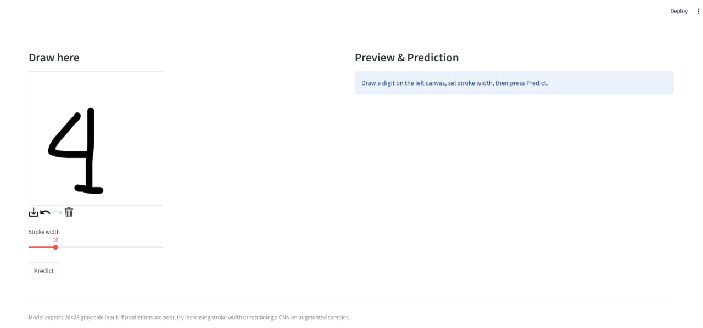
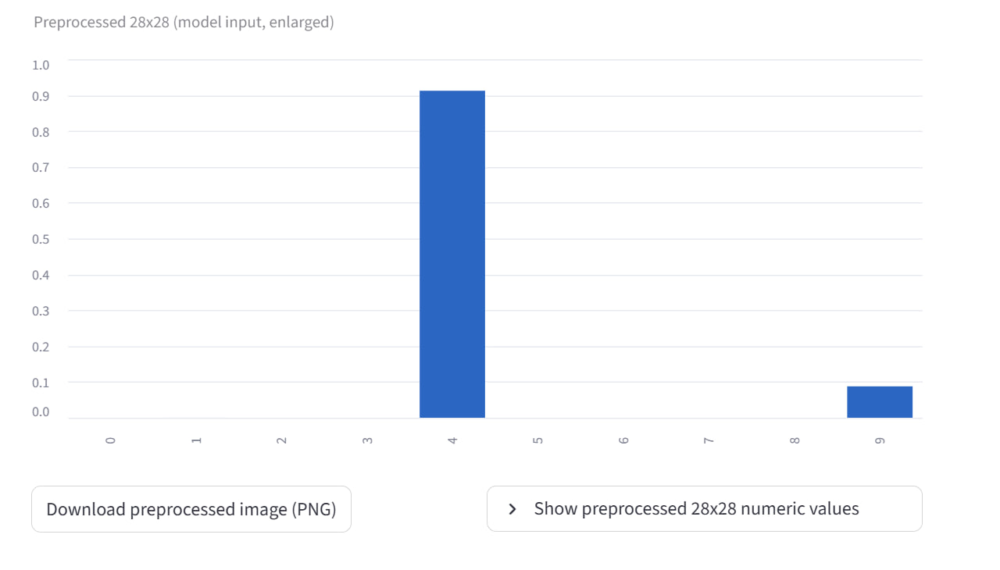

# PMDL — Practical Machine Learning & Deep Learning Assignment 1

---

## 🚀 Quick Start

### 1. Clone the repo

```bash
git clone https://github.com/your-username/PMDL.git
cd PMDL
```

### 2. Start the services

```bash
docker-compose up --build
```

This will start 3 containers:

* **MLflow** → [http://localhost:5000](http://localhost:5000)
* **FastAPI** (model API) → [http://localhost:8000/docs](http://localhost:8000/docs)
* **Streamlit** (web UI) → [http://localhost:8501](http://localhost:8501)

Run in background:

```bash
docker-compose up -d
```

Stop containers:

```bash
docker-compose down
```

---

## ✨ Getting A Prediction

### Streamlit UI

Use canvas to draw a digit, adjust brush width to your liking:



Press the predict button to see the result:


You can see additional information under the result:




---

## 🔍 How It Works

1. **Data Preparation**

   * MNIST dataset is loaded and split into `data/raw` and `data/processed` via DVC.

2. **Model Training**

   * CNN model defined in `code/models/train_digits.py`.
   * Training uses data augmentation and logs metrics to MLflow.
   * Best model is saved to `models/digit_recognizer_cnn.h5`.

3. **Deployment**

   * **FastAPI** loads the trained model and exposes `/predict`.
   * **Streamlit** provides a drawing canvas and sends images to the API.
   * **MLflow** is available for experiment tracking.

---

## 📂 Repo Structure

```
PMDL/
├── .dvc/
├── code/
│   ├── datasets/
│   │   └── split_data.py
│   ├── deployment/
│   │   ├── api/
│   │   │   ├── __pycache__/
│   │   │   ├── main.py
│   │   │   ├── requirements_api.txt
│   │   │   └── Dockerfile  # for api
│   │   ├── app/
│   │   │   ├── app.py
│   │   │   ├── requirements_app.txt
│   │   │   └── Dockerfile  # for app
│   └── models/
│       └── train_digits.py
├── data/
├── docs/
├── dvcstore/
├── mlruns/  # root MLflow directory
├── models/  # saved models
├── services/
│   └── airflow/
│       └── dags/
│           └── pipeline_mnist.py
├── logs/
├── venv/
├── .dvcignore
├── .gitignore
├── docker-compose.yml
├── README.md
└── requirements.txt
```

---

## ✅ Requirements

* Docker Desktop
* Git
* (Optional) Python 3.10+ and virtualenv if training locally

---

## 📝 Notes

* Model can be retrained with:

  ```bash
  python code/models/train_digits.py
  ```

---
